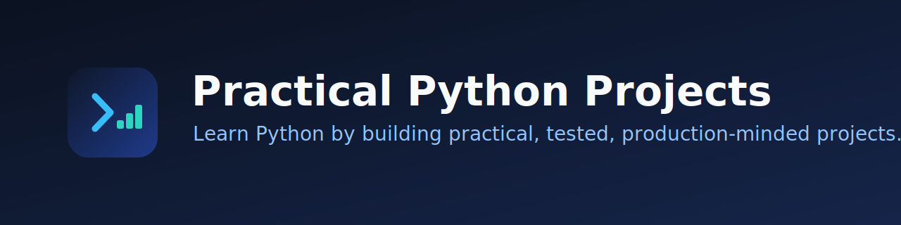

# Practical Python Projects



[](https://github.com/vietIT2002/practical-python-projects/actions/workflows/quality.yml)
[](LICENSE)
[](pyproject.toml)

**Learn Python by building practical, tested, and production-minded projects.**

A curated, open-source collection of complete Python projects for self-taught
learners, students, and developers who want to grow from fundamentals to
production-minded engineering — one runnable, tested project at a time.

**[Browse projects](#browse-projects) · [Quick start](#quick-start) · [Learning paths](docs/learning-paths.md)**

> **Status: early foundation.** The structure, toolchain, and contributor
> experience are in place; learning projects are being added incrementally. See
> the [roadmap](docs/roadmap.md).

## Why this collection is different

- **It runs.** Every published project runs from documented commands on a clean
  clone — no missing steps.
- **It is tested.** Projects include tests for happy-path, invalid-input, and
  boundary behaviour, and the whole repository is checked in
  [continuous integration](docs/maintainers/ci.md).
- **It is consistent.** A shared structure, naming convention, and quality bar
  make each project easy to navigate once you have seen one.
- **It states what you will learn.** Each project lists concrete learning
  objectives and honest limitations.
- **It is safe by default.** Destructive operations require confirmation or a
  preview, and secrets never live in the code.

## Browse projects

Projects are grouped by difficulty:

- **[Beginner](beginner/README.md)** — small, standard-library projects.
- **[Intermediate](intermediate/README.md)** — structured applications.
- **[Advanced](advanced/README.md)** — services, pipelines, and integrations.

New here? A [learning path](docs/learning-paths.md) gives you a suggested order
instead of picking at random.

### Available projects

<!-- project-index:start -->
| Project | Level | What you build |
|---|---|---|
| [Expense Tracker CLI](beginner/01-expense-tracker/README.md) | beginner | Track expenses from the command line with exact money handling and safe storage. |
| [Safe File Organizer CLI](beginner/02-file-organizer/README.md) | beginner | Organise files into category folders with a dry-run default, no overwrites, and undo. |
| [URL Shortener API](intermediate/01-url-shortener-api/README.md) | intermediate | A FastAPI URL shortener with SQLAlchemy, migrations, and isolated tests. |
<!-- project-index:end -->

The table above is generated from each project's metadata; see the full
[project catalog](docs/project-catalog.md).

## Quick start

You need [Python 3.12+](https://www.python.org/downloads/),
[uv](https://docs.astral.sh/uv/), and git. From the repository root:

```sh
uv sync --group dev        # install the development toolchain
uv run pytest              # run the tests
```

Full setup and the complete list of quality commands are in the
[development environment guide](docs/getting-started/development-environment.md).

## Quality

Every published project is expected to run from a clean clone, be tested at
happy-path, invalid-input, and boundary levels, and pass formatting, linting,
type checking, and tests. See
[draft vs published](docs/repository-map.md#draft-vs-published) for the exact
bar.

## Documentation

- [Documentation home](docs/README.md)
- [Repository map](docs/repository-map.md) — where everything lives.
- [Architecture decisions](docs/architecture/README.md) — why it is built this
  way.

## Contributing

Contributions are welcome. Start with the [contributing guide](CONTRIBUTING.md),
and please follow the [Code of Conduct](CODE_OF_CONDUCT.md). For security issues,
use the private route in [SECURITY.md](SECURITY.md).

## Roadmap

See the [roadmap](docs/roadmap.md) for what exists now and what is planned.

## License

Released under the [MIT License](LICENSE).
