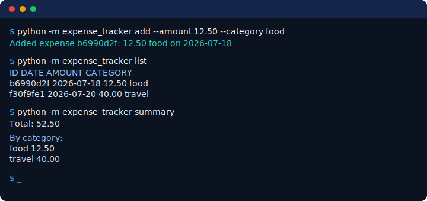

# Expense Tracker CLI

Track expenses from the command line with exact money handling and safe storage.
A small, dependency-free project that shows how to model data, validate input,
handle money correctly, and persist data without ever losing it.

- **Difficulty:** beginner
- **Estimated time:** ~3 hours
- **Prerequisites:** functions, basic classes
- **Python:** 3.12+ (standard library only — no third-party dependencies)

## What you will learn

- Model records with a typed `dataclass`.
- Use `Decimal` so money arithmetic is exact (`0.10 + 0.20 == 0.30`).
- Validate command-line input and ISO dates with clear error messages.
- Separate CLI parsing, business logic, and persistence.
- Write files atomically so a failed write never corrupts existing data.
- Test happy-path, invalid-input, and boundary behaviour.

## Features

- `add` an expense with amount, category, date, and an optional note.
- `list` expenses, optionally filtered by month and category.
- `summary` totals overall, by month, and by category.
- `delete` an expense by its id, with a clear not-found error.
- A configurable data-file path; the file is created safely on first use.

**Non-goals:** no GUI, no cloud sync, no authentication, no database, no
multi-user support.

## Demo



```text
$ python -m expense_tracker --data-file expenses.json add \
    --amount 12.50 --category food --date 2026-07-18 --note "team lunch"
Added expense b6990d2f: 12.50 food on 2026-07-18

$ python -m expense_tracker --data-file expenses.json list
ID        DATE            AMOUNT  CATEGORY
b6990d2f  2026-07-18       12.50  food  (team lunch)
f30f9fe1  2026-07-20       40.00  travel

$ python -m expense_tracker --data-file expenses.json summary
Total: 52.50

By month:
  2026-07       52.50

By category:
  food                  12.50
  travel                40.00
```

## Setup

This project has no third-party dependencies, so any Python 3.12+ interpreter
works. From this project directory:

```sh
cd beginner/01-expense-tracker
```

**Linux / macOS:**

```sh
PYTHONPATH=src python -m expense_tracker --help
```

**Windows (PowerShell):**

```powershell
$env:PYTHONPATH = "src"; python -m expense_tracker --help
```

You can try it immediately against the bundled sample data:

```sh
PYTHONPATH=src python -m expense_tracker --data-file examples/expenses.sample.json summary
```

## Usage

```text
python -m expense_tracker [--data-file PATH] <command> [options]

commands:
  add       add an expense (--amount, --category, --date, --note)
  list      list expenses (--month YYYY-MM, --category)
  summary   totals by month and category (--month YYYY-MM)
  delete    delete an expense by id
```

- `--date` defaults to today. Dates use ISO `YYYY-MM-DD`.
- Amounts must be positive and are rounded to two decimal places.
- Notes are limited to 200 characters.

## Tests and quality

From the repository root:

```sh
uv run pytest beginner/01-expense-tracker/tests
uv run ruff check .
uv run mypy .
```

## Architecture

```text
src/expense_tracker/
  __main__.py   # enables `python -m expense_tracker`
  cli.py        # argument parsing and input/output only
  services.py   # pure business logic (create, filter, summarise, delete)
  models.py     # the typed Expense record and (de)serialisation
  storage.py    # safe, atomic JSON persistence
  errors.py     # the exception hierarchy
```

The domain logic in `services.py` is pure: it never parses arguments, prints, or
touches the filesystem, which makes it easy to test. `cli.py` is the only place
that reads input and writes output, and it turns domain errors into exit codes.

## Key decisions

- **Money uses `Decimal`.** Binary floats cannot represent values like `0.10`
  exactly, which corrupts totals. Amounts are stored as strings in JSON to keep
  that exactness on disk.
- **JSON, not CSV.** JSON preserves structure and lets the amount be stored as an
  exact string. CSV is simpler and spreadsheet-friendly, but every value becomes
  a string and nested structure is awkward; for a small typed record, JSON is
  the clearer teaching choice.
- **Atomic writes.** Saving writes to a temporary file and then replaces the
  target in one step, so an interrupted write cannot corrupt existing data.

## Security and privacy

- All data stays in the local JSON file you choose; nothing is sent anywhere.
- The sample data is synthetic.
- Stored data is validated on load; a malformed file raises a clear error
  instead of silently discarding valid records.

## Limitations

- Single user, single machine; no concurrency control for simultaneous writes.
- No currency conversion — amounts are treated as a single currency.
- Not intended for large datasets; the whole file is read and written each time.

## Extension challenges

1. Add an `edit` command to change an existing expense.
2. Add a `--currency` field and per-currency summaries.
3. Export a monthly summary to CSV.
4. Add budgets per category and warn when a month exceeds its budget.

## Troubleshooting

- **`No module named expense_tracker`** — set `PYTHONPATH=src` (see Setup), or run
  from the repository root with `uv run`.
- **`error: date '...' must be in ISO format`** — use `YYYY-MM-DD`, e.g.
  `2026-07-20`.
- **`error: ... is not valid JSON`** — the data file is corrupt; restore it or
  point `--data-file` at a fresh path.

## License and contributing

Released under the repository [MIT License](../../LICENSE). See
[CONTRIBUTING.md](../../CONTRIBUTING.md).
