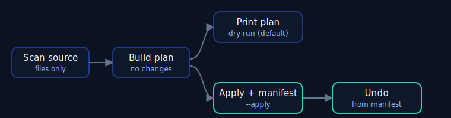

# Safe File Organizer CLI

Organise a folder of files into category subfolders — safely. A dry run is the
default, existing files are never overwritten, and every applied run can be
undone.

- **Difficulty:** beginner
- **Estimated time:** ~4 hours
- **Prerequisites:** functions, basic classes
- **Python:** 3.12+ (standard library only — no third-party dependencies)

> ⚠️ **Back up important files before using `--apply` on real data.** This tool
> moves files. It is designed to be safe (dry-run default, no overwrites, undo
> via a manifest), but you should still try it on a copy first. The demo below
> uses a throwaway temporary folder so you can experiment without risk.

## What you will learn

- Work with `pathlib` safely and cross-platform.
- Separate a **plan** from its **execution** — plan first, change later.
- Handle filename conflicts deterministically without overwriting.
- Design a dry-run workflow and a reversible operation with a manifest.
- Test filesystem behaviour with temporary directories.

## Features

- `organize` scans one source directory (no recursion) and classifies files by
  extension into category folders.
- **Dry run by default** — it prints the plan and changes nothing until you pass
  `--apply`.
- **Never overwrites**: name conflicts get a deterministic ` (1)`, ` (2)` suffix.
- Ignores subdirectories and symlinks.
- Keeps every destination inside the destination root (rejects unsafe
  categories).
- Writes an undo **manifest** after a successful apply.
- `undo` reverses an applied run, refusing any move that would be unsafe or
  ambiguous.

**Non-goals:** no recursive organisation, no deleting duplicates, no continuous
watching, no cloud storage.

## How it works



## Safe demo (temporary folder)

**Linux / macOS:**

```sh
cd beginner/02-file-organizer
work="$(mktemp -d)"; mkdir "$work/inbox"
touch "$work/inbox"/photo.jpg "$work/inbox"/report.pdf "$work/inbox"/song.mp3

# 1) Dry run — see the plan, nothing moves:
PYTHONPATH=src python -m file_organizer organize "$work/inbox" "$work/sorted"

# 2) Apply — move files and write a manifest:
PYTHONPATH=src python -m file_organizer organize "$work/inbox" "$work/sorted" --apply

# 3) Undo — restore everything:
PYTHONPATH=src python -m file_organizer undo "$work/sorted/file-organizer-manifest.json" --apply
```

**Windows (PowerShell):**

```powershell
cd beginner/02-file-organizer
$work = New-Item -ItemType Directory -Path (Join-Path $env:TEMP ("fo-" + [guid]::NewGuid()))
New-Item -ItemType Directory -Path "$work/inbox" | Out-Null
"x" | Set-Content "$work/inbox/photo.jpg", "$work/inbox/report.pdf"
$env:PYTHONPATH = "src"
python -m file_organizer organize "$work/inbox" "$work/sorted"
python -m file_organizer organize "$work/inbox" "$work/sorted" --apply
python -m file_organizer undo "$work/sorted/file-organizer-manifest.json" --apply
```

Example dry-run output:

```text
Planned moves (3):
  photo.jpg  ->  images/photo.jpg
  report.pdf  ->  documents/report.pdf
  song.mp3  ->  audio/song.mp3

Dry run. Re-run with --apply to move files.
```

## Usage

```text
python -m file_organizer organize <source> <destination> [--apply]
                                  [--config categories.json] [--manifest PATH]
python -m file_organizer undo <manifest> [--apply]
```

- Without `--apply`, both commands only show what they *would* do.
- `--config` accepts a JSON file mapping categories to extensions; see
  [`examples/categories.sample.json`](examples/categories.sample.json).
- The manifest defaults to `<destination>/file-organizer-manifest.json`.

## Tests and quality

From the repository root:

```sh
uv run pytest beginner/02-file-organizer/tests
uv run ruff check .
uv run mypy .
```

## Architecture

```text
src/file_organizer/
  __main__.py   # enables `python -m file_organizer`
  cli.py        # argument parsing and input/output only
  classify.py   # extension -> category rules (with optional config)
  planner.py    # builds a plan without touching the filesystem
  executor.py   # applies and undoes moves, reports partial failure
  manifest.py   # reads and writes the undo manifest
  models.py     # typed Move, Skip, and Plan records
  errors.py     # the exception hierarchy
```

Planning is pure and side-effect-free; only `executor.py` touches the
filesystem, and only `cli.py` reads input and writes output.

## Key decisions

- **Dry run is the default.** The safe action requires no flag; the destructive
  action requires `--apply`. This makes accidents hard.
- **Never overwrite.** Conflicts are resolved with a numeric suffix, so no file
  is ever silently replaced.
- **Reversible.** A manifest records each move so `undo` can restore them, and
  `undo` refuses any reversal that is missing or would overwrite.
- **Contained.** Destinations are validated to stay inside the destination root,
  so a crafted category cannot escape it.

## Security and privacy

- The tool only reads the source directory you name and writes inside the
  destination you name; nothing is sent anywhere.
- Symlinks are not followed, avoiding surprises outside the chosen folders.
- The sample configuration contains no personal paths.

## Limitations

- Single directory level (no recursion) by design.
- A partial failure stops at the first error and reports what completed and what
  was not attempted; it does not automatically roll back completed moves (use
  `undo` with the written manifest).
- Not intended for enormous directories in a single run.

## Extension challenges

1. Add a `--recursive` option that organises nested folders safely.
2. Add a `--by-date` mode that files things into `YYYY/MM` folders.
3. Detect duplicate files (same contents) and report them without deleting.
4. Add a rollback that undoes a partial apply automatically.

## Troubleshooting

- **`No module named file_organizer`** — set `PYTHONPATH=src` (see the demo), or
  run from the repository root with `uv run`.
- **`error: source is not a directory`** — check the source path.
- **Files got a ` (1)` suffix** — that means a file with the same name already
  existed in the destination; nothing was overwritten.

## License and contributing

Released under the repository [MIT License](../../LICENSE). See
[CONTRIBUTING.md](../../CONTRIBUTING.md).
